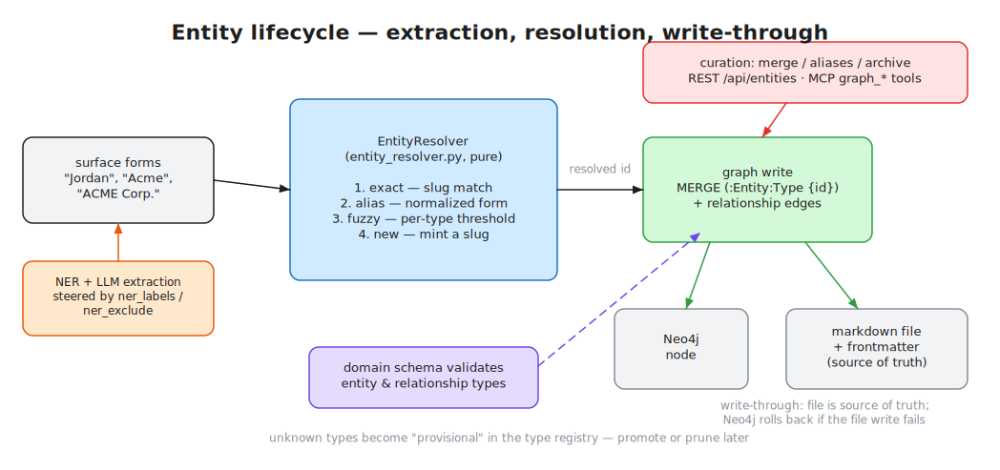

# Entities & the Knowledge Graph

> **Audience:** developers and agents working with entity extraction, resolution, or the graph ·
> **Source of truth:** `app/services/entity_resolver.py`, `app/services/graph/`, `app/model_schemas/domain_config.py` ·
> **See also:** [Domain Schemas](../customization/domain-schemas.md) · [Ingestion Pipeline](ingestion-pipeline.md)

*Editable source: [`docs/diagrams/entity-lifecycle.excalidraw`](../diagrams/entity-lifecycle.excalidraw)*

## The one rule that explains everything here

**Entity types are not hardcoded — they come from the active domain schema.** The set of
entity types, their attributes, and the valid relationships between them are declared in
`config/domains/<domain>.yaml` and validated on every graph write
(`app/services/graph/neo4j_graph.py:2071`). The static `EntityType` enum in
`app/models/api/core.py` is legacy and only covers a narrow old path. If you want a new entity
type, you edit YAML, not Python — see [Domain Schemas](../customization/domain-schemas.md).

## Entity lifecycle

1. **Extraction** — during ingestion, entities are surfaced by domain-aware NER
   (`app/services/semantica_extraction.py`, steered by the schema's `ner_labels` /
   `ner_exclude`) and salience-aware LLM extraction
   (`app/services/salient_entity_extractor.py`).
2. **Resolution** — every surface form goes through the canonical matcher before anything is
   written (see below).
3. **Graph write** — resolved entities are MERGEd into Neo4j as `(:Entity:<TypeLabel> {id})`
   (`neo4j_graph.py:2120`) with **write-through to a markdown file**: each entity is also a
   markdown document with YAML frontmatter in the git corpus, and the files are the source of
   truth. If a brand-new node's file write fails, the Neo4j write is rolled back
   (`neo4j_graph.py:2144-2167`).
4. **Enrichment** — meeting/document mentions update entity profile documents
   (`app/services/entity_meeting_enricher.py`); grounded profiles are regenerated after ingest.
5. **Curation** — humans (or agents) merge duplicates, edit aliases, archive/restore via the
   entity-management API or the `graph_*` MCP tools.

### Entity resolution

`app/services/entity_resolver.py` is the single authority for "is this name an existing
entity?" — shared by the pipeline and the eval harness (`evals/harness/matching.py`), and
implemented as a pure function (`resolve_against`, `:184`) so it's unit-testable.

The chain (never crosses entity types):

| Step | Match | How |
|---|---|---|
| 1 | `exact` | generated slug equals an existing node id (`make_slug`, `:131`) |
| 2 | `alias` | normalized form equals a node name or known alias (`surface_forms_equivalent`, `:121`) |
| 3 | `fuzzy` | per-type `SequenceMatcher` threshold on normalized names; persons also get nickname/initial handling (`_person_name_variation`, `:151`) |
| 4 | `new` | mint a fresh slug |

Tuning knobs, all in that file: `FUZZY_THRESHOLDS` (`:57` — person 0.85,
account/company/team 0.88, project 0.90), `_NICKNAMES` (`:66`), `normalize_entity_name`
(`:95` — strips titles, legal suffixes, type words), and `_digit_token_conflict` (`:144` — the
veto that stops "Q3 Planning" merging with "Q4 Planning").

> ⚠️ A second, older deduper exists (`app/services/entity_deduplication.py`, used by the batch
> upload path, with overlapping nickname/normalization logic). `entity_resolver.py` is the
> newer, preferred surface — change resolution behavior there.

### Entity management API

Curation endpoints live in `app/routes/entity_management.py`:

- `POST /api/entities/{id}/merge` — merge duplicate → survivor, with a non-mutating `preview`
  mode, type-compatibility guard, and `ENTITY_MERGED` webhook. Requires the Neo4j backend.
- `POST /api/entities/{id}/aliases` / `DELETE .../{alias}` — alias curation.
- `PUT /api/entities/{id}` · `DELETE` (soft-archive) · `POST .../restore`.

Plus search, suggestions, bulk operations, enrichment, and webhooks across the other
`app/routes/entity_*.py` modules (aggregated in `app/modules/entities/__init__.py`).

## Graph layer

### Backends

`get_knowledge_graph()` (`app/services/graph/factory.py:39`) is tenant-scoped and resolves to:

- **`Neo4jKnowledgeGraph`** (`app/services/graph/neo4j_graph.py`) — the primary
  implementation, when Neo4j is up.
- **In-memory `KnowledgeGraph`** (`app/services/graph/builder.py`) — a pure-Python fallback
  rebuilt from the entity markdown files. The graph auto-upgrades to Neo4j when it becomes
  available. Some operations (e.g. entity merge) require the Neo4j backend and return 503 on
  the fallback.

A third layer, `get_semantica_knowledge()` (`factory.py:110`), adds hybrid vector search +
extraction on top.

### Schema is generated from the domain config

`app/services/graph/neo4j_schema.py` generates all constraints and indexes from the active
domain — zero hardcoded types. `entity_type_to_label` camel-cases type ids
(`interview_session` → `InterviewSession`); `relationship_type_to_neo4j` uppercases
relationship types (`has_projects` → `HAS_PROJECTS`). `initialize_schema_from_domain` runs at
startup and is idempotent.

### What's in the graph

| Node label | Written by | Notes |
|---|---|---|
| `:Entity` + `:<TypeLabel>` | `neo4j_graph.py:2120` | every entity is dual-labeled with its domain type |
| `:Document` | `neo4j_graph.py:720` | keyed by corpus path |
| `:Entity:Signal` | `app/services/graph/signal_graph_writer.py:19` | signals are dual-labeled; entity queries filter `WHERE NOT n:Signal` |
| `:_TypeRegistry` | `app/services/graph/type_registry.py` | graduated-typing metadata |

| Relationship | Direction | Meaning |
|---|---|---|
| domain types (`HAS_PROJECTS`, `WORKS_AT`, …) | Entity→Entity | from the domain YAML `relationships:` blocks |
| `MENTIONED_IN` | Entity→Document | provenance |
| `CO_OCCURRENCE` | Entity–Entity | entities sharing a document |
| `MENTIONS` / `ASSIGNED_TO` / `FOR_CLIENT` | Signal→Entity | signal attribution, ownership, client scoping |
| `SUPERSEDES` / `CONFLICTS_WITH` | Signal→Signal | decision lineage (see [Signals & Governance](signals-and-governance.md)) |

### Graduated typing

`TypeRegistryService` (`app/services/graph/type_registry.py`) tracks every entity,
relationship, and attribute type as **canonical** (declared in the domain YAML) or
**provisional** (created at runtime by a user or agent), plus aliased/deprecated states. This
is how the system tolerates agents inventing types without polluting the schema: provisional
types are recorded, visible in `/api/type-registry`, and can be promoted into the domain YAML
later. Usage recording is best-effort on the hot path.

## Customization points

| You want to… | Do this |
|---|---|
| Add an entity or relationship type | Edit the active domain YAML — schema constraints, write validation, and the type registry all follow automatically. No code change. [Guide](../customization/domain-schemas.md) |
| Make matching stricter/looser | `FUZZY_THRESHOLDS` in `app/services/entity_resolver.py:57` |
| Add nickname/normalization rules | `_NICKNAMES` / `normalize_entity_name` in the same file |
| Steer NER toward/away from names | `ner_labels` / `ner_exclude` on the entity in the domain YAML |
| React to entity events | Entity webhooks (`app/routes/entity_webhooks.py`, `EntityEventType`) |
| Swap or extend the graph backend | Implement the `KnowledgeGraph` surface; selection in `app/services/graph/factory.py` |
