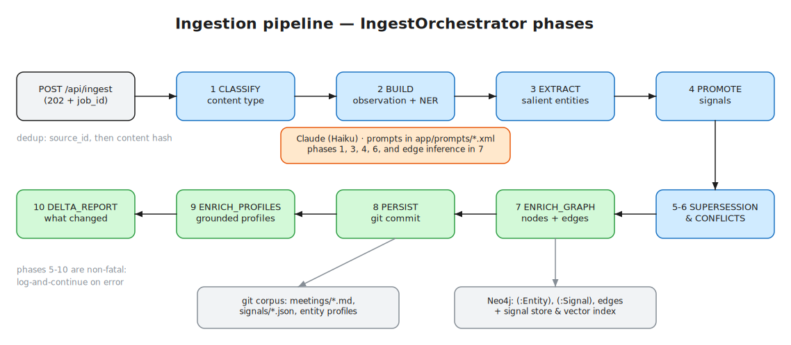

# Ingestion Pipeline

> **Audience:** developers and agents extending intake or the enrichment pipeline ·
> **Source of truth:** `app/routes/ingest.py`, `app/services/orchestrators/ingest_orchestrator.py` ·
> **See also:** [Entities & Graph](entities-and-graph.md) · [Signals & Governance](signals-and-governance.md) · [Customization map](../customization/README.md)

Everything imi knows starts as a piece of text that entered through this pipeline. Content
arrives through one of several intake surfaces, is classified, mined for entities and signals,
and lands in three synchronized stores: the Neo4j graph, the git-backed markdown corpus, and
the signal/memory stores.

*Editable source: [`docs/diagrams/ingestion-pipeline.excalidraw`](../diagrams/ingestion-pipeline.excalidraw) — re-export with `node scripts/export_diagrams.mjs`.*

## Intake surfaces

| Surface | Endpoint / entry | Code | Notes |
|---|---|---|---|
| Generic ingest | `POST /api/ingest` (202) | `app/routes/ingest.py:167` | The front door. `IngestRequest`: `content` (required, ≤500 KB), `source`, `source_id`, `title`, `participants`, `timestamp`, `metadata` |
| Job status | `GET /api/ingest/{job_id}/status`, `/jobs`, `/{job_id}/delta`, `/{job_id}/stream` (SSE) | `app/routes/ingest.py:195-262` | Live phase progress via SSE events `ingest_phase` / `ingest_complete` / `ingest_failed` |
| Transcript drop-in | `POST /api/ingest/zapier` | `app/routes/ingest_zapier.py:52` | Adapter for call recorders (Otter, Fathom, Grain, Fireflies, Zoom). Maps `provider` → `ContentSource`, builds an `IngestRequest`, delegates to the front door |
| GitHub webhook | `POST /api/webhook/github` | `app/routes/webhook.py:97` | Separate pipeline — see below |
| File upload | `POST /upload` | `app/routes/upload.py:26` | Multipart, `.md`/`.txt` only, ≤25 KB. Separate inline pipeline |
| Thought capture | `POST /api/captures` | `app/routes/captures.py` | Free-form notes straight into the memory layer (also exposed as the `capture_thought` MCP tool) |
| MCP tool | `add_call_transcript` | `app/services/chat_tools.py:1733` | Synchronous bridge: enqueues, then polls the job store (`submit_and_wait`, `app/routes/ingest.py:115`) |
| Pull connectors | `python -m app.connectors` | `app/connectors/__main__.py:67` | Exports recordings (currently Grain) to JSONL of `IngestRequest`s, which you then POST to `/api/ingest` |

Request/response models live in `app/models/ingestion/models.py` (`IngestRequest`, `IngestResponse`,
`IngestJobStatus`, `ContentSource`, `ContentType`).

## The orchestrated pipeline

`POST /api/ingest` → `enqueue_ingestion` (`app/routes/ingest.py:53`) → global task queue →
`IngestOrchestrator.process()` (`app/services/orchestrators/ingest_orchestrator.py:87`, phase
list at `:72-84`). Each phase is tracked in the job store and emitted over SSE.

| # | Phase | What happens | Code |
|---|---|---|---|
| 1 | `CLASSIFY` | Source hint maps directly to a content type; otherwise a small LLM call decides. Falls back to `document` | `app/services/ingest_classifier.py:65` |
| 2 | `BUILD_MEETING` | Builds an `Observation` (`app/models/observation.py`); recovers timestamps from `Date:` headers; seeds `entities_mentioned` from participants + domain-aware NER | `ingest_orchestrator.py:467` |
| 3 | `EXTRACT_ENTITIES` | Salience-aware entity extraction (`app/services/salient_entity_extractor.py`), resolved through `EntityResolver` (`app/services/entity_resolver.py`). Participants and subjects are promoted; passing mentions only link if they resolve to existing entities | `ingest_orchestrator.py:559` |
| 4 | `PROMOTE_SIGNALS` | LLM extraction of typed signals — `decision`, `action_item`, `key_point`, `insight` — with a regex fallback. Decisions under confidence 0.7 are tagged `tier="candidate"` | `app/services/signal_promoter.py:69` |
| 5 | `DETECT_SUPERSESSION` | Finds earlier signals this content may supersede; annotates `signal.metadata` (non-fatal) | `ingest_orchestrator.py:1129` |
| 6 | `DETECT_CONFLICTS` | LLM conflict detection between new and existing signals (skipped without an API key; non-fatal) | `ingest_orchestrator.py:1192` |
| 7 | `ENRICH_GRAPH` | Writes it all to Neo4j: entity nodes (domain-filtered, MERGE-based), signal nodes (`SignalGraphWriter`), and inferred entity↔entity edges validated against the active domain schema | `ingest_orchestrator.py:686` |
| 8 | `PERSIST` | Commits `meetings/meeting-{bot_id}.md` and `signals/meeting-{bot_id}.json` to the git corpus | `ingest_orchestrator.py:1315` |
| 9 | `ENRICH_PROFILES` | Saves signals to the signal store and regenerates grounded entity profile documents | `ingest_orchestrator.py:1360` |
| 10 | `DELTA_REPORT` | Renders a human-readable "what changed" report (`deltas/delta-{bot_id}.md`), served at `/api/ingest/{job_id}/delta` | `ingest_orchestrator.py:1264` |
| 11 | `COMPLETE` | Aggregates counts into the job result | `ingest_orchestrator.py:358` |

Phases 5–10 are individually wrapped: a failure logs and continues rather than failing the job.
Only phases 1–4 and 7 are load-bearing for a usable result.

### Where Claude is invoked

All LLM calls route through `ClaudeClient.generate_message` (`app/services/claude_client.py:378`),
which resolves endpoints via the `InferenceRegistry` (`app/services/inference/registry.py`) —
with no `config/inference.yaml` present, everything goes to Anthropic.

| Call | Prompt | Model |
|---|---|---|
| Content classification | inline in `app/services/ingest_classifier.py:33` | default (Sonnet) |
| Signal extraction | `app/prompts/signal_promote.xml` | Haiku |
| Salient entity extraction | `app/prompts/transcript_entity_extract.xml` | Haiku |
| Relationship inference | `app/prompts/extract_relationships.xml` | Haiku |
| Entity extraction tool | `app/prompts/entity_extract.xml` | Haiku |
| Conflict detection | `app/services/conflict_detector.py` | — |

Prompts are XML files in `app/prompts/` loaded at runtime by `app/services/prompt_loader.py` —
**editing the `<instructions>` block changes extraction behavior with no code change**. The
loader also hashes prompts (`prompt_sha`) so the eval harness (`scripts/run_evals.py`) can track
prompt versions.

Retry behavior: the client retries rate-limit/connection errors up to 5 times with backoff and
token-bucket rate limiting (`claude_client.py:569-643`). Each extraction has a non-LLM fallback
(classifier → `document`; signals → regex; entities → keep existing).

## Job tracking, idempotency, failure

- **Job store** — an in-memory dict (`app/routes/ingest.py:37`) keyed by `job:{job_id}`,
  content hash, and `source_id:{source_id}`. *Ephemeral: lost on restart.* Job status shape:
  `status`, `content_type`, `phases_completed[]`, `current_phase`, `result`, `error`.
- **Task queue** — in-process `asyncio.PriorityQueue`, max concurrency 3
  (`app/services/task_queue.py:95`). No broker; failures surface but don't auto-retry.
- **Idempotency** — dedup by `source_id` first, then SHA-256 content hash
  (`ingest.py:71-88`); duplicates return the existing `job_id` with status `duplicate` (200
  instead of 202). Signal IDs are deterministic (`uuid5` of type + meeting + position +
  content), and graph writes are MERGE-based, so re-ingesting the same content overwrites
  instead of duplicating. **Always send a stable `source_id` from connectors.**

## The two side pipelines

Two intake surfaces intentionally do *not* go through the orchestrator:

- **GitHub webhook** (`app/services/orchestrators/webhook_orchestrator.py:67`) — pulls changed
  repo files and runs document-oriented enrichment (`DomainAwareEntityExtractor`, metadata
  analysis, pattern detection, digest). Workflow classes: `app/workflows/document_analyzer.py`,
  `app/workflows/commit_enricher.py`.
- **File upload** (`process_file_background`, `app/routes/upload.py:164`) — a hardcoded linear
  sequence (metadata → index/extract → profile updates → digest → git commit).

If you're adding a new source, prefer the front door (`/api/ingest`) over cloning one of these.

## Customization points

| You want to… | Do this |
|---|---|
| Add a push source (new recorder, Slack, email…) | Write a thin adapter route that builds an `IngestRequest` and calls `ingest_content` — copy the pattern in `app/routes/ingest_zapier.py`. Add a `ContentSource` value (`app/models/ingestion/models.py:15`) and mapping entries (`ingest_zapier.py:20`, `ingest_classifier.py:17`) |
| Add a pull connector | Subclass `BaseConnector` (`app/connectors/base.py:7`): `list_recordings`, `fetch_recording`, `to_ingest_request`. See `GrainConnector` (`app/connectors/grain.py:153`) |
| Change what gets extracted | Edit the prompt XML in `app/prompts/` — no code change |
| Route inference to other models/providers | Create `config/inference.yaml` (see `config/inference.yaml.example`); per-operation routing to Anthropic / vLLM / Bedrock / OpenAI-compatible endpoints |
| Change which entity/relationship types are persisted | Edit the active domain schema — the graph-enrichment phase validates against it. See [Domain Schemas](../customization/domain-schemas.md) |
| Add a pipeline stage | Add a phase name to `PHASES` (`ingest_orchestrator.py:72`), write a `_phase_*` coroutine, insert a `_run_phase(...)` call in `_run_observation_phases` (`:240`). Status tracking and SSE come for free |
| Add an extraction tool | Register in `_get_extraction_tools` (`app/routes/ingest.py:406`); tools subclass `AgentTool` (`app/services/agent_tools.py`) |

Known hardcoded seams (accepted for the community edition): phase ordering, the in-memory job
store, the 500 KB / 25 KB size limits, queue concurrency of 3, and the inline classifier prompt.
