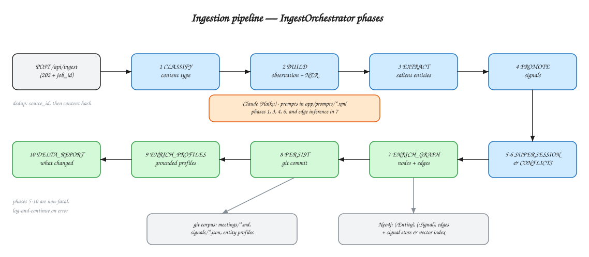

# Ingestion Pipeline

> **Audience:** developers and agents extending intake or the enrichment pipeline ·
> **Source of truth:** `app/routes/ingest.py`, `app/services/orchestrators/ingest_orchestrator.py` ·
> **See also:** [Entities & Graph](entities-and-graph.md) · [Signals & Governance](signals-and-governance.md) · [Customization map](../customization/README.md)

Everything imi knows starts as a piece of text that entered through this pipeline. Content
arrives through one of several intake surfaces, is classified, mined for entities and signals,
and lands in three synchronized stores: the Neo4j graph, the git-backed markdown corpus, and
the signal/memory stores.

*Editable source: [`docs/diagrams/ingestion-pipeline.excalidraw`](../diagrams/ingestion-pipeline.excalidraw) — re-export with `node scripts/export_diagrams.mjs`.*

## Intake surfaces

| Surface | Endpoint / entry | Code | Notes |
|---|---|---|---|
| Generic ingest | `POST /api/ingest` (202) | `app/routes/ingest.py:167` | The front door. `IngestRequest`: `content` (required, ≤500 KB), `source`, `source_id`, `title`, `participants`, `timestamp`, `metadata` |
| Job status | `GET /api/ingest/{job_id}/status`, `/jobs`, `/{job_id}/delta`, `/{job_id}/stream` (SSE) | `app/routes/ingest.py:195-262` | Live phase progress via SSE events `ingest_phase` / `ingest_complete` / `ingest_failed` |
| Transcript drop-in | `POST /api/ingest/zapier` | `app/routes/ingest_zapier.py:52` | Adapter for call recorders (Otter, Fathom, Grain, Fireflies, Zoom). Maps `provider` → `ContentSource`, builds an `IngestRequest`, delegates to the front door |
| GitHub webhook | `POST /api/webhook/github` | `app/routes/webhook.py:97` | Separate pipeline — see below |
| File upload | `POST /upload` | `app/routes/upload.py:26` | Multipart, `.md`/`.txt` only, ≤25 KB. Separate inline pipeline |
| Thought capture | `POST /api/captures` | `app/routes/captures.py` | Free-form notes straight into the memory layer (also exposed as the `capture_thought` MCP tool) |
| MCP tool | `add_call_transcript` | `app/services/chat_tools.py:1733` | Synchronous bridge: enqueues, then polls the job store (`submit_and_wait`, `app/routes/ingest.py:115`) |
| Pull connectors | `python -m app.connectors` | `app/connectors/__main__.py:67` | Exports recordings (currently Grain) to JSONL of `IngestRequest`s, which you then POST to `/api/ingest` |

Request/response models live in `app/models/ingestion/models.py` (`IngestRequest`, `IngestResponse`,
`IngestJobStatus`, `ContentSource`, `ContentType`).

## The orchestrated pipeline

`POST /api/ingest` → `enqueue_ingestion` (`app/routes/ingest.py:53`) → global task queue →
`IngestOrchestrator.process()` (`app/services/orchestrators/ingest_orchestrator.py:87`, phase
list at `:72-84`). Each phase is tracked in the job store and emitted over SSE.

| # | Phase | What happens | Code |
|---|---|---|---|
| 0 | `ADMIT` | Lane admission ([ADR-003](../adr/ADR-003-record-and-library-lanes.md)): `record` (we were party to it), `library` (third-party content), or drop. Source default from `config/lanes.yaml` (on the MCP channel, record-default sources are judged unless in `mcp_trusted_sources` — [ADR-007](../adr/ADR-007-agent-mediated-intake.md)), automated-mail rule, then the decision model (op `lane_admission`, off/shadow/on; off → per-item falls back to `record`). A drop ends the job with status `dropped` and a row in `memory/admission/`; nothing is built | `app/services/lane_admission.py` |
| 1 | `CLASSIFY` | Source hint maps directly to a content type; otherwise a small LLM call decides. Falls back to `document` | `app/services/ingest_classifier.py:65` |
| 2 | `BUILD_MEETING` | Builds an `Observation` (`app/models/observation.py`); recovers timestamps from `Date:` headers; seeds `entities_mentioned` from participants + domain-aware NER | `ingest_orchestrator.py:467` |
| 2b | `SYNTHESIZE` | Record-lane `call_transcript` only: summarizes the transcript with `app/prompts/meeting_finalize.xml` (op `meeting_summary`) into six sections (Summary, Key Discussion Points, Decisions, Action Items, Next Steps, Insights) plus a one-line purpose. Sets `Observation.summary`/`purpose`/`key_points`; the model title replaces only the `Ingested <type>` placeholder. Presentation only — signals are still promoted from the transcript body. Not run by a rebuild replay (the file keeps its summary); backfill older meetings with `scripts/backfill_meeting_synthesis.py` (non-fatal) | `app/services/meeting_synthesis.py` |
| 3 | `EXTRACT_ENTITIES` | Salience-aware entity extraction (`app/services/salient_entity_extractor.py`), resolved through `EntityResolver` (`app/services/entity_resolver.py`). Participants and subjects are promoted; passing mentions only link if they resolve to existing entities | `ingest_orchestrator.py:559` |
| 4 | `PROMOTE_SIGNALS` | LLM extraction of typed signals — `decision`, `action_item`, `key_point`, `insight` — with a regex fallback. Decisions under confidence 0.7 are tagged `tier="candidate"`. Record-lane signals then go to the decision model (op `signal_promotion_triage`, off/shadow/on): type (or not substantive), firm vs proposed for decisions, owner among the meeting's people for action items, and client among its client entities. `shadow` records verdicts in `metadata.triage` beside the heuristic values; `on` acts on confident answers (provisional bars) and never re-decides a reviewed signal (non-fatal) | `app/services/signal_promoter.py:69`, `app/services/signal_triage.py` |
| 4b | `DETECT_DUPLICATES` | Nearest same-type signals (vector index, cosine ≥ 0.78, within 30 days) plus earlier signals of the batch are put to the decision model (op `signal_duplicate`, off/shadow/on): same / earlier_richer / later_richer / overlap / different. In `on` the less complete statement of a same-fact pair gets `metadata.duplicate_of` (hidden from feed, search, recall and decision views, listed as `corroborated_by` on the kept one); a reviewed or instruction-grade signal is never hidden behind a new one; overlaps become `metadata.related_signals`. Nothing is deleted (non-fatal) | `ingest_orchestrator.py`, `app/services/signal_dedup.py` |
| 5 | `DETECT_SUPERSESSION` | Proposes earlier decisions this one may supersede by shared non-person entities, then the decision model (op `signal_relation`, off/shadow/on) labels each pair supersedes / refines / restates / conflicts / unrelated; in `on` only a confident `supersedes` stays pending for review, the rest are kept as dismissed by the model. Annotates `signal.metadata` (non-fatal) | `ingest_orchestrator.py`, `app/services/signal_relation.py` |
| 6 | `DETECT_CONFLICTS` | LLM conflict detection between new and existing signals (skipped without an API key; non-fatal) | `ingest_orchestrator.py:1192` |
| 7 | `ENRICH_GRAPH` | Writes it all to Neo4j: entity nodes (domain-filtered, MERGE-based), signal nodes (`SignalGraphWriter`), and inferred entity↔entity edges validated against the active domain schema | `ingest_orchestrator.py:686` |
| 8 | `PERSIST` | Commits `meetings/meeting-{bot_id}.md` and `signals/meeting-{bot_id}.json` to the git corpus. A summarized meeting's body is the summary (frontmatter `purpose`, `key_points`, `summary_prompt`) with the transcript once under `## Full Transcript`; unsummarized files keep the `## Discussion` copy. `Observation.from_markdown` rebuilds the extraction body from the transcript when `summary_prompt` is set | `ingest_orchestrator.py:1315` |
| 9 | `ENRICH_PROFILES` | Saves signals to the signal store and regenerates grounded entity profile documents | `ingest_orchestrator.py:1360` |
| 10 | `DELTA_REPORT` | Renders a human-readable "what changed" report (`deltas/delta-{bot_id}.md`), served at `/api/ingest/{job_id}/delta` | `ingest_orchestrator.py:1264` |
| 11 | `COMPLETE` | Aggregates counts into the job result | `ingest_orchestrator.py:358` |

Phases 5–10 are individually wrapped: a failure logs and continues rather than failing the job.
Only phases 1–4 and 7 are load-bearing for a usable result.

### Library lane (ADR-003 §3, ADR-006)

A `library` observation runs the same phases with these gates. The defaults below are
ADR-003's; a deployment changes them in the `library:` section of `config/lanes.yaml`
([ADR-006](../adr/ADR-006-library-primary-deployments.md), `lane_admission.library_policy`).

- **BUILD_MEETING**: no participants; named people become `authors` (text, never person
  nodes). An `IngestRequest.metadata.publisher` is appended to `authors`.
- **PROMOTE_SIGNALS**: every signal becomes a `claim`: `metadata.attributed_to`, `as_of`,
  `extracted_type`; owner/status/due cleared; `stale_after` set (library decay; none when
  `library.decay.enabled: false`, horizons from `library.decay.horizons_days`).
- **ENRICH_GRAPH**: link only by default (`library.entities.mode: link_only`). Entities that
  don't resolve to an *existing* node are dropped; no admission create path, no `add_node`,
  no fuller-name upgrades, `entity_link` verification is link-only (renames keep our name,
  splits unlink). With `mode: allowlist`, new entities of a `create_types` type go through the
  same `entity_admission` gate as record content and are added if kept
  (`_admit_library_entities`); existing nodes are still never renamed or re-written.
  Relationship inference runs only with `library.infer_relationships: true`.
- **Attribution** (ADR-006 §5, `_attribute_claims`): each author/publisher is resolved
  (heuristic resolver) against the domain's person/organization-like types
  (`library.attribution_types`); matches are stored on every claim as
  `metadata.attributed_to_ids` and written as `(Signal)-[:ATTRIBUTED_TO]->(Entity)`.
  An unmatched source is created only via the allowlist + admission; otherwise the
  `attributed_to` string is the only attribution. Because the ids live in the signal file,
  a rebuild reproduces the edges, and entity merges rewrite them (`remap_entity_refs`).
- **ENRICH_PROFILES**: skipped (signals are still saved).
- **PERSIST**: the meeting file carries `lane: library` and `authors:`; a rebuild
  (`neo4j_graph._extract_entity_references`) links such a file only to its recorded
  `entity_ids` and never mints stubs from its name fields. Record files are unchanged.

### Where Claude is invoked

All LLM calls route through `ClaudeClient.generate_message` (`app/services/claude_client.py:378`),
which resolves endpoints via the `InferenceRegistry` (`app/services/inference/registry.py`) —
with no `config/inference.yaml` present, everything goes to Anthropic.

| Call | Prompt | Model |
|---|---|---|
| Content classification | inline in `app/services/ingest_classifier.py:33` | default (Sonnet) |
| Signal extraction | `app/prompts/signal_promote.xml` | Haiku |
| Salient entity extraction | `app/prompts/transcript_entity_extract.xml` | Haiku |
| Relationship inference | `app/prompts/extract_relationships.xml` | Haiku |
| Entity extraction tool | `app/prompts/entity_extract.xml` | Haiku |
| Conflict detection | `app/services/conflict_detector.py` | — |
| Meeting summary | `app/prompts/meeting_finalize.xml` | default (Sonnet) |

Prompts are XML files in `app/prompts/` loaded at runtime by `app/services/prompt_loader.py` —
**editing the `<instructions>` block changes extraction behavior with no code change**. The
loader also hashes prompts (`prompt_sha`) so the eval harness (`scripts/run_evals.py`) can track
prompt versions.

Retry behavior: the client retries rate-limit/connection errors up to 5 times with backoff and
token-bucket rate limiting (`claude_client.py:569-643`). Each extraction has a non-LLM fallback
(classifier → `document`; signals → regex; entities → keep existing).

## Job tracking, idempotency, failure

- **Job store** — an in-memory dict (`app/routes/ingest.py:37`) keyed by `job:{job_id}`,
  content hash, and `source_id:{source_id}`. *Ephemeral: lost on restart.* Job status shape:
  `status`, `content_type`, `phases_completed[]`, `current_phase`, `result`, `error`.
- **Task queue** — in-process `asyncio.PriorityQueue`, max concurrency 3
  (`app/services/task_queue.py:95`). No broker; failures surface but don't auto-retry.
- **Idempotency** — dedup by `source_id` first, then SHA-256 content hash
  (`ingest.py:71-88`); duplicates return the existing `job_id` with status `duplicate` (200
  instead of 202). Signal IDs are deterministic (`uuid5` of type + meeting + position +
  content), and graph writes are MERGE-based, so re-ingesting the same content overwrites
  instead of duplicating. **Always send a stable `source_id` from connectors.**

## The two side pipelines

Two intake surfaces intentionally do *not* go through the orchestrator:

- **GitHub webhook** (`app/services/orchestrators/webhook_orchestrator.py:67`) — pulls changed
  repo files and runs document-oriented enrichment (`DomainAwareEntityExtractor`, metadata
  analysis, pattern detection, digest). Workflow classes: `app/workflows/document_analyzer.py`,
  `app/workflows/commit_enricher.py`.
- **File upload** (`process_file_background`, `app/routes/upload.py:164`) — a hardcoded linear
  sequence (metadata → index/extract → profile updates → digest → git commit).

If you're adding a new source, prefer the front door (`/api/ingest`) over cloning one of these.

## Customization points

| You want to… | Do this |
|---|---|
| Add a push source (new recorder, Slack, email…) | Write a thin adapter route that builds an `IngestRequest` and calls `ingest_content` — copy the pattern in `app/routes/ingest_zapier.py`. Add a `ContentSource` value (`app/models/ingestion/models.py:15`) and mapping entries (`ingest_zapier.py:20`, `ingest_classifier.py:17`) |
| Add a pull connector | Subclass `BaseConnector` (`app/connectors/base.py:7`): `list_recordings`, `fetch_recording`, `to_ingest_request`. See `GrainConnector` (`app/connectors/grain.py:153`) |
| Change what gets extracted | Edit the prompt XML in `app/prompts/` — no code change |
| Change which lane a source lands in, or drop a sender | `config/lanes.yaml` (see `config/lanes.yaml.example`); turn model judgment on with `decisions.modes.lane_admission: on` in `config/inference.yaml` |
| Run a library-primary deployment (research, policy, analyst teams) | `library:` / `recall:` in `config/lanes.yaml` ([ADR-006](../adr/ADR-006-library-primary-deployments.md)): `decay.enabled` / `decay.horizons_days`, `entities.mode: allowlist` + `entities.create_types` (through entity admission), `infer_relationships`, `attribution_types`, `recall.default_lanes`. Bad values warn and fall back to the defaults (= ADR-003). Read claims over time with the `list_claims` MCP tool |
| Route inference to other models/providers | Create `config/inference.yaml` (see `config/inference.yaml.example`); per-operation routing to Anthropic / vLLM / Bedrock / OpenAI-compatible endpoints |
| Change which entity/relationship types are persisted | Edit the active domain schema — the graph-enrichment phase validates against it. See [Domain Schemas](../customization/domain-schemas.md) |
| Add a pipeline stage | Add a phase name to `PHASES` (`ingest_orchestrator.py:72`), write a `_phase_*` coroutine, insert a `_run_phase(...)` call in `_run_observation_phases` (`:240`). Status tracking and SSE come for free |
| Add an extraction tool | Register in `_get_extraction_tools` (`app/routes/ingest.py:406`); tools subclass `AgentTool` (`app/services/agent_tools.py`) |

Known hardcoded seams (accepted for the community edition): phase ordering, the in-memory job
store, the 500 KB / 25 KB size limits, queue concurrency of 3, and the inline classifier prompt.
