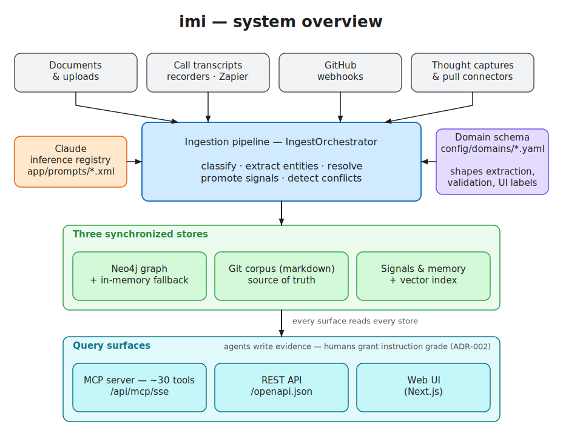

# System Overview

> **Audience:** everyone — read this first ·
> **See also:** the [documentation index](../README.md) for reading paths by role

imi is a self-hosted knowledge engine: text goes in (documents, transcripts, commits), a
knowledge graph plus a governed memory comes out, and everything is queryable by humans (web
UI) and agents (MCP) in real time.

*Editable source: [`docs/diagrams/system-overview.excalidraw`](../diagrams/system-overview.excalidraw) — edit at [excalidraw.com](https://excalidraw.com), re-export with `node scripts/export_diagrams.mjs`.*

## The five-minute mental model

1. **Content enters** through one of the intake surfaces — `POST /api/ingest` is the front
   door; Zapier/recorder drop-in, GitHub webhooks, file upload, thought captures, and pull
   connectors all funnel into it or run small side pipelines.
   → [Ingestion Pipeline](ingestion-pipeline.md)

2. **The pipeline classifies and mines it.** Claude classifies the content, extracts salient
   entities and typed signals (decisions, action items, key points, insights), detects
   supersession and conflicts with what's already known.
   → [Ingestion Pipeline](ingestion-pipeline.md)

3. **A domain schema shapes everything.** One YAML file (`config/domains/<domain>.yaml`)
   declares your entity types, attributes, relationships, NER steering, intelligence
   patterns, and UI labels. Extraction, graph validation, agent prompts, and the frontend all
   read it. This is the single highest-leverage customization point.
   → [Domain Schemas](../customization/domain-schemas.md)

4. **Results land in three synchronized stores:**
   - the **Neo4j graph** — entities, documents, signals, relationships (with a pure-Python
     in-memory fallback);
   - the **git corpus** — every entity and meeting is also a markdown file with frontmatter;
     files are the source of truth and graph writes roll back if the file write fails;
   - the **signal/memory stores + vector index** — governed records with semantic recall
     (SQLite vectors by default).
   → [Entities & Graph](entities-and-graph.md) · [Memory & Vectors](memory.md)

5. **Everything is queryable** over MCP (~30 tools: search, traversal, Cypher, signals,
   memory recall/writeback, graph mutations) and REST. Governance is enforced at this
   boundary: agents read everything, write evidence, and can never mint instruction-grade
   memory — that takes a human review action.
   → [MCP & API](mcp-and-api.md) · [Signals & Governance](signals-and-governance.md)

## Runtime topology

Two containers via `docker compose up`:

| Container | What runs inside | Ports |
|---|---|---|
| `imi-app` | supervisord → **nginx** (:8080, public) → **FastAPI** (uvicorn :8000) + **Next.js** frontend (:3000) | `127.0.0.1:8080` |
| `imi-neo4j` | Neo4j 5.26 community, healthchecked; app waits for healthy | `127.0.0.1:7474`, `127.0.0.1:7687` |

State lives in the `imi-neo4j-data` volume, `./data` (SQLite app DB + `vectors.db`), and
`./repo` (the git corpus). Config mounts read-only from `./config`.

## Trust architecture (worth internalizing early)

Two orthogonal axes govern every signal and memory record:

- **Temporal:** is this decision `active`, `stale`, `superseded`, `conflicting`…? Computed at
  read time, never stored.
- **Authority:** may this record *instruct* an agent, or only serve as *evidence*?
  Instruction grade requires human confirmation (or trusted import) — enforced by model
  validators, the review state machine, and re-checked at recall time (ADR-002).

If you build anything that writes signals or memories, read
[Signals & Governance](signals-and-governance.md) first.

## Code map

| Path | What lives there |
|---|---|
| `app/routes/` | ~55 FastAPI routers (intake, entities, signals, memory, MCP server, admin) |
| `app/services/` | the engine: orchestrators, extraction, resolution, governance, recall, graph layer (`graph/`), inference routing (`inference/`) |
| `app/services/orchestrators/` | `IngestOrchestrator` (the pipeline), `WebhookOrchestrator` |
| `app/agents/` | in-process agents: chat (Claude Agent SDK), memory, insights, pattern recognition |
| `app/models/` + `app/model_schemas/` | Pydantic models; `model_schemas/domain_config.py` is the authoritative domain-schema model |
| `app/prompts/` | XML prompt files — edit these to change extraction behavior |
| `app/core/` | domain-config loading, tenancy seam, middleware |
| `config/domains/` | domain schemas (6 examples ship) |
| `imi-frontend/` | Next.js UI (labels/nav driven by the domain schema at runtime) |
| `docs/adr/`, `docs/prd/` | design decisions — ADR-002 is load-bearing |
| `scripts/`, `evals/` | operational scripts, extraction eval harness |

## Editions

This is the community edition. The hosted edition layers SSO/multi-tenant auth, live meeting
capture, and calendar integration on top of documented seams: `create_app(extra_routers=...)`
(`app/main.py:1116`), the tenancy container (`app/core/tenancy/`), and `AUTH_MODE`. Those
seams are why some indirection exists that a single-tenant reading wouldn't need.
