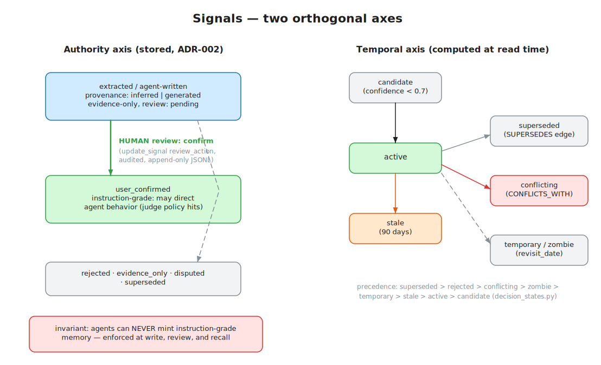

# Signals, Decisions & Governance

> **Audience:** anyone building on imi's decision/memory layer — this is the most
> design-constrained part of the system ·
> **Source of truth:** `app/models/signal.py`, `app/services/signal_governance.py`,
> `app/services/decision_states.py`, `docs/adr/ADR-001…`, `docs/adr/ADR-002…` ·
> **See also:** [Memory & Vectors](memory.md) · [MCP & API](mcp-and-api.md)

A **signal** is a typed, governed statement extracted from content: a `decision`, an
`action_item`, a `key_point`, or an `insight` (`app/models/signal.py:33`). Signals are what
turn a pile of transcripts into an organizational memory you can trust — and "trust" here is a
literal, enforced axis, not a vibe.

*Editable source: [`docs/diagrams/signal-governance.excalidraw`](../diagrams/signal-governance.excalidraw)*

## The two orthogonal axes

The design (ADR-001 + ADR-002 + the two PRDs in `docs/prd/`) deliberately separates:

1. **Temporal lifecycle** — *is this decision current?* Computed, never stored
   (`app/services/decision_states.py`).
2. **Trust/authority** — *may this be used to instruct an agent, or only as evidence?*
   Stored governance fields with an enforced invariant
   (`app/services/signal_governance.py`).

### Axis 1: temporal lifecycle

`compute_decision_state(signal)` (`decision_states.py:109`) derives one of, in precedence
order: `superseded` → `rejected` → `conflicting` → `zombie` → `temporary` → `stale` →
`active` → `candidate`. Staleness kicks in at 90 days (`STALE_AGE_DAYS`);
`metadata.revisit_date` drives `temporary`/`zombie`; `metadata.conflicts_with` drives
`conflicting`. Because the state is derived at read time, there is no state-update job to
fall behind.

Decision lineage is explicit in the graph: `SUPERSEDES` (new→old) and `CONFLICTS_WITH`
edges between Signal nodes (`app/services/graph/signal_graph_writer.py:81,102`), both
idempotent and tenant-scoped.

### Axis 2: trust/authority (ADR-002)

Every governed record carries:

- `provenance_status` — one of `observed`, `inferred`, `user_confirmed`, `imported`,
  `generated`, `superseded`, `disputed` (`signal_governance.py:29`)
- `review_status` — `pending`, `confirmed`, `evidence_only`, `rejected`, `stale`, `merged`
- `can_use_as_evidence` (default **true**) and `can_use_as_instruction` (default **false**)

**The invariant:** `can_use_as_instruction` requires
`provenance_status ∈ {user_confirmed, imported}` — enforced by a Pydantic model validator on
the record itself (`app/models/signal.py:132`), re-checked in the review state machine, and
re-hydrated from the authoritative store at recall time. Practical consequence:

> **An agent can never mint instruction-grade memory.** Pipeline-extracted signals enter as
> `inferred`/`pending`; agent writebacks are clamped to `generated`; only a human review
> transition (`update_signal(review_action="confirm")` via MCP, or the review endpoints)
> grants instruction grade.

Authority fields are **server-injected and never client-settable** — keep them out of any
new API input models, or you've built a privilege escalation.

### The review state machine

`apply_review(signal, action, …)` (`signal_governance.py:87`) is a pure function returning a
new Signal. Actions: `confirm` (→ `user_confirmed`, instruction-grade), `reject`,
`evidence_only`, `dispute`, `supersede` (sets `valid_to` + `superseded_by`, clears
instruction grade). Each action maps to an ADR-001 gate response: `allow` / `block` /
`revise` / `escalate`.

`review_with_audit(...)` (`app/services/signal_audit.py:55`) wraps it with an immutable
`SignalAuditRecord` — actor, gate response, before/after governance snapshots — appended to
**append-only JSONL** under `repo/signals/audit/`, which survives even hard deletion of the
signal. It's duck-typed, so the same audit path covers signals, captured memories, and agent
memories.

## How signals are born

During ingestion, `SignalPromoter.promote(observation)`
(`app/services/signal_promoter.py:69`):

- **LLM path** — Claude Haiku with `app/prompts/signal_promote.xml`; deduplication, quality
  filter, per-signal entity attribution. Sets `provenance_status="inferred"`,
  `review_status="pending"`. Decisions under confidence 0.7 are tagged
  `metadata.tier="candidate"`.
- **Regex fallback** — parses markdown section headers (Decisions / Action Items / …). Sets
  `provenance_status="observed"`.

Then: `SignalStore.save` persists JSON (and indexes vectors on write),
`SignalGraphWriter.write_meeting_signals` writes graph nodes and the
`MENTIONS`/`ASSIGNED_TO`/`FOR_CLIENT` edges.

## Working with signals

| Surface | What |
|---|---|
| REST | `GET /api/signals/feed`, signal transitions in `app/routes/signal_mutations.py` (close/reopen/in-progress/update, bulk), `GET /api/decisions`, `POST /api/{captures,memories}/{id}/review` |
| MCP | `search_signals`, `search_signals_semantic` (authority-aware), `list_decisions`, `get_decision` (with lineage + audit), `get_constitution`, `update_signal` (fields **and** the governance `review_action`), `delete_signal` |
| Judge | `POST /api/judge/recall` returns evidence **plus** `policy_hits` — instruction-grade memory and confirmed decisions with `required_behavior` ∈ allow/block/revise/escalate. `POST /api/judge/decisions` records idempotent decision events (`app/services/judge_service.py`) |

The "constitution" (`get_constitution`) renders all confirmed, active decisions as a single
markdown document — the closest thing to "current org policy" the system can produce.

## Customization points

| You want to… | Do this |
|---|---|
| Change what counts as a decision/action item | Edit `app/prompts/signal_promote.xml` |
| Tune the candidate threshold | `DECISION_CANDIDATE_THRESHOLD` in `app/services/signal_promoter.py:37` |
| Change staleness policy | `STALE_AGE_DAYS` in `app/services/decision_states.py` |
| Add signal routing / approval gates per type | Declarative in the domain YAML per ADR-001 — routing entry + optional gate, no code |
| Add a new governed record kind | Follow the Signal/CapturedMemory/AgentMemory pattern; import `instruction_grade_permitted`, enforce it in a model validator, wire indexing + recall resolvers. See [Memory & Vectors](memory.md) |

**What not to customize:** the authority invariant itself. Everything downstream — judge
policy hits, recall filtering, the review queue — assumes it holds.
